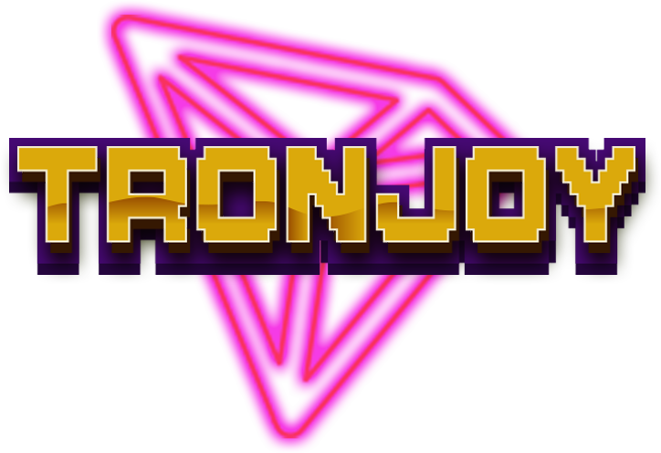
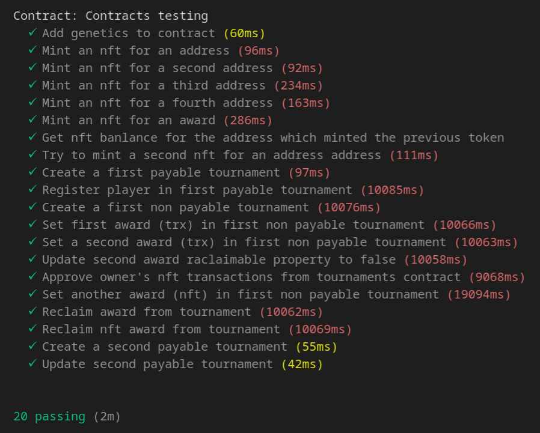
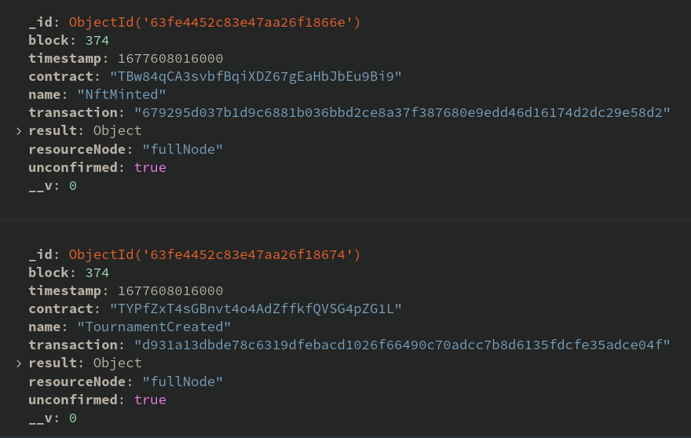

# Tronjoy Contracts



## Descripción

Este repositorio contiene una colección de contratos acompañados de sus tests, herramientas de despliegue y scripts de lanzamientos de eventos.
La función principal de estos contratos es la de gestionar los torneos de la dapp de Tronjoy y el minteo de los nfts asociados.

## Primeros pasos

### Instalar tronbox en nuestra máquina de manera global

TronBox es una herramienta para desarrollar, probar e implementar contratos inteligentes. Está diseñado para cadenas de bloques que utilizan la máquina virtual TRON (TVM). Compilación, vinculación, implementación y administración binaria de contratos inteligentes incorporados.

Para instalarlo en nuestro sistema operativo utilizaremos el comando:

```sh
npm install -g tronbox
```

### Decargar el repositorio

Nos ubicaremos con nuestra terminal en el directorio en el que queramos que esté ubicado el proyecto y después ejecutarmos el siguiente comando:

```sh
http://gitlab.3fera.com/tronjoy/contracts-tron.git
```

### Instalar todos los paquetes de software necesarios

Dentro del direcorio raíz del proyecto ejecutaremos el comando:

```sh
npm i
```

### Adaptar los contratos de Open Zeppelin

OpenZeppelin es un conjunto de contratos inteligentes auditados y aprobados por su comunidad, completamente seguros y listos para ser utilizados en tus propios contratos. Al utilizar contratos de OpenZeppelin, obtienes los siguientes beneficios: Desarrollo de casos de uso complejos. Reducción del tiempo de desarrollo.

Si nos fijamos en nuestro package.json, tenemos declarado como dependencia open zeppelin, lo que significa que nuestra carpeta node_modules tiene que contener un directorio llamado @openzeppelin el cual contendrá los contratos.

Dichos contratos, están preparados para funcionar dentro de la máquina virtual de Ethereum. El problema que tenemos es que, en este caso, vamos a trabajar con la TVM (Tron Virtual Machine) por lo que tenemos que hacer una modificación que consistirá en reemplazar todas las funciones isContract por isContractTron desde visual Studio en la carpeta node_modules/@openzeppelin.

## Entornos de trabajo

Debido a las particularidades que presenta este desarrollo usaremos tres entornos de trabajo diferentes que vamos a explicar a continuación.

### Local

Cuando hablamos de entorno de trabajo local nos referimos a crear un nodo en nuestro propio equipo. Este nodo será el único de una TVM local que arrancaremos en un docker.

Este entorno será el que empleaaremos para realizar el testing y generar eventos que generen una colección de MngoDB que nos servirá para hacer pruebas en el backend de nuestra dapp.

### Testnet (Shasta)

Cuando estemos testeando nuestra dapp en desarrollo apuntaremos a los contratos inteligentes que tengamos desplegados en la red de pruebas.

### Red principal de tron (Tron Mainnet)

Aquí desplegaremos los contratos definitivos a los que apuntaremos en producción.

## Arranque del nodo local

Las instrucciones de descarga y arranque las tenemos en el siguiente repositorio: https://github.com/TRON-US/docker-tron-quickstart no obstante, vamos a repasar los comandos más importantes.

Como vamos a correr la TVM en un docker, en primer lugar debemos asegurarnos de tener Docker instalado y arrancado.

Una vez tengamos docker preparado en nuestro equipo ejecutaremos el comando:

```sh
./start_node.sh
```

Con ello ejecutaremos un archivo start_node.sh que se encuentra en la raíz de nuestro proyecto y que contiene una instrucción docker run para arrancar nuestro contenedor:

```sh
docker run -it --rm \
  -p 9090:9090 \
  -e "defaultBalance=100000" \
  -e "showQueryString=true" \
  -e "showBody=true" \
  -e "formatJson=true" \
  -e "mnemonic=treat nation math panel calm spy much obey moral hazard they sorry" \
  --name tron \
  trontools/quickstart
```

En en comando podemos apreciar que tenemos el contenedor corriendo en el puerto 9090 de nuestro contenedor y lo mapeamos al mismo 9090 de nuestro sistema operativo.

También podemos ver que utilizamos diferentes variables de entorno (opción -e). Las más importantes de estas variables de entorno son:

- defaultBalance: Se trata del balace por defecto de cada una de las cuentas que van a generase en nuestra TVM local.

- mnemonic: Es un conjunto de palabras que va a posibilitar que las cuentas generadas sean siempre las mismas de manera que no podremos hacer pruebas con la seguridad de que siempre vamos a emplear las mismas claves. Con esto nos ahorramos tener que cambiarlas cada vez que arranquemos de nuevo el nodo.

## Lanzamiento de los tests

Dentro de la carpeta test encontraremos un archivo llamado contracts.test.js. Es aquí donde se encuentran nuestros tests.

Para ejecutarlos ejecutaremos el siguiente comando:

```sh
tronbox test
```

Si los tests han dado resultado positivo la terminal mostrará una pantall similar a esta:



## Cómo migrar los contratos

Para poder llamar a los contratos en la máquina virtual primeramente hay que migrarlos. La cofiguración para realizar está migración debemos hacerla en el archivo tronbox.js que se encuentra en la raíz de nuestro proyecto.

A continuación vamos a mostrar cómo tendríamos el archivo configurado para hacer un despliegue en la TVM local o en la testnet de Shasta.

```js
module.exports = {
  networks: {
    shasta: {
      privateKey: process.env.SHASTA_OWNER_ACCOUNT,
      userFeePercentage: 50,
      feeLimit: 1000 * 1e6,
      fullHost: "https://api.shasta.trongrid.io",
      network_id: "2",
    },
    development: {
      privateKey: process.env.LOCAL_OWNER_ACCOUNT,
      userFeePercentage: 0,
      feeLimit: 1000 * 1e6,
      fullHost: "http://127.0.0.1:9090",
      network_id: "9",
    },
    compilers: {
      solc: {
        version: "0.8.6",
      },
    },
  },
};
```

Con este archivo correctamente configurado y el nodo arrancado (recordemos que podíamos ponerlo en marcha con < ./start_node.sh >) ya podemos hacer una migración a local (en las networks sería development).

Dentro de la carpeta scripts tenemos dos ejecutables local-migrate.sh y shasta-migrate.sh que nos permitirán migrar los contraos a las redes de localhost y shasta respectivamente.

Para migrar a la máquina virtual local ejecutaremos:

```sh
./scripts/local-migrate.sh
```

Si quisieramos migralo a Shasta lo haríamos de la siguiente forma:

```sh
./scripts/shasta-migrate.sh
```

## Lanzar los eventos para generar documentos en MongoDB:

Para trabajar en el desarrollo de nuestro backend nos conviene tener una base de datos de MongoDB poblada con eventos generados localmente que el producer pueda procesar.

Con el objetivo de escuchar los eventos y guardarlos en una colección de tron hemos preparado unos watchers.

Comentar que, previamente, deberemos de arrancar una base de datos de MongoDB en el puerto 27017 de nuestra máquina.

Una vez hecho esto, los pasos para generar estos eventos serán los siguientes:

- Arrancar el nodo de Tron:

```
sh start_node.sh
```

- Desplegar los contratos en nuestra red local:

```
sh scripts/local-migrate.sh
```

- Arrancar los watchers:

```
npm run watch
```

- Hacer llamadas a los contratos para generar eventos:

```
node events-generator/calls.js
```

Una vez terminado el proceso, deberíamos tener nuestra base de datos poblada con eventos como los que aparecen en la siguiente imágen.



## Contratos

A continuación, vamos a revisar las funcionalicades que contienen los contratos.

<table>
  <caption>TJoyArcade</caption>
  <thead>
    <th>Método</th>
    <th>Inputs</th>
    <th>Outputs</th>
    <th>Eventos lanzados</th>
    <th>Descripción</th>
  </thead> 
  <tbody>
    <tr>
      <td>getNftBalance</td>
      <td>address _address</td>
      <td>uint256 balanceOf(_address)</td>
      <td></td>
      <td>Devuelve la cantidad de nfts de tipo Arcade que tiene esta address. Por cómo estamos gestionando el contrato deberá ser 0 o 1, ya que no se permite la acuñación de más de un nft por address.</td>
    </tr>
    <tr>
      <td>getGen</td>
      <td>uint256 _tokenId</td>
      <td>uint256 genetics[_tokenId]</td>
      <td></td>
      <td>Devuelve la genética de un nft en concreto a partir de su id.</td>
    </tr>
    <tr>
      <td>getTokenIdFromGen</td>
      <td>uint256 _gen</td>
      <td>uint256 tokenIdToGen[_gen];</td>
      <td></td>
      <td>Devuelve el id de un nft en concreto a partir de su genética.</td>
    </tr>
    <tr>
      <td>safeMint</td>
      <td>address to, uint256 gen</td>
      <td>uint256 tokenId</td>
      <td>NftMinted(to, tokenId, gen)</td>
      <td>Es el encargado de, mediante el llamado al método _safeMint del contrato ERC721, mintear el nuevo nft de tipo Arcade. Este método sólo puede ser llamado por un contrato que tenga asignado el rol de minter.</td>
    </tr>
  </tbody> 
</table>
